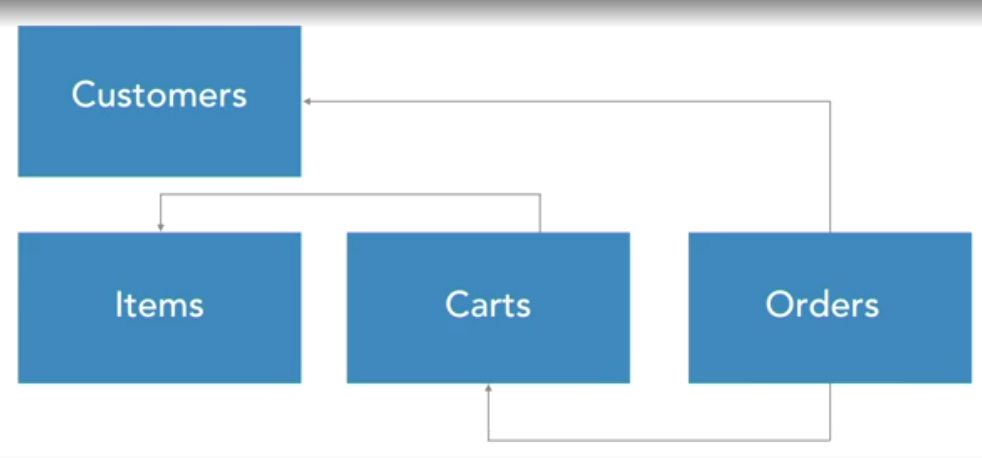

# Designing RESTful APIs & Building APIs in PHP using the Slim micro framework

## Designing RESTful APIs

- API design must be deliberate:
  - decide what, how and the best way to expose functionality
  - test and (in)validate assumptions
  - Repeat

Affordance: something that allows you to perform an action or accomplish a goal (doorknob, lightswitch)

Intersection of

- what the API does
- what the API makes easy
- what the user wants to do

### Three approaches to add an API

- bolt-on strategy (adding an API to an existing system, for example OTAQ)
  - can use existing code
  - Problems in application leak to API (bad naming conventions)
- Greenfield strategy (new system)
  - API first / mobile first mindst
  - takes advantage of new tech and architectures
  - Drawbacks: massive effort up front
- Facade strategy
  - Replacing systems piece by piece
  - Keeps legacy systems functional while making underlying architecture better
  - can be difficult to have different approaches / mindsets in same system
  - can be hard to replicate behavior 1:1

### Tips for modeling API

- Don't worry about the tools (post it notes or kanban process)
- Have a consistent process (roles in team etc)
- It doesn't count unless it's written down / document everything

### Planning / design process

1. Identify participants
2. Identify activities
3. Break into steps
4. Create API definitions
5. Validate API

#### 1. Identifying participants (person or entity)

- Identify People / entities who will use the API
- who / what is involved in the business process
  - anyone who initiates an action indirectly or directly
  - anyone who waits for an action to occur
- What do we need to know?
  - Who are they (assing names)
  - Are they internal or external?
  - are they active (initiating action) or passive (waiting for an action) participants?
- Be mindful of system boundaries
  - Clearly identify what you are responsible for and what are other / third party components
  
Example: Ordering a cup of coffe in a coffee shop

- **Participants:**

  - The patron (you)
  - The barista
  - The cashier
  - Probably over the realm of your responsability:
    - The payment processor
    - The other customers

#### 2. Identifying activities and breaking them into steps

What are the steps?

- Revision 1 (too abstract, doesn't take interactions of participants into account):
  1. place order
  2. wait for order
  3. receive order

- Revision 2 (clearly names participants, dependencies and order):
  1. **Patron** places an order with the **cashier**
  2. **casheir** passes order to **barista**
  3. **barista** acknowledges order and adds it to quere
  4. **cashier** tells **patron** the bill
  5. **patron** provides payment, which is accepted or rejected
  6. **barista** makes orders and delivers them to **patron**

Course example: Ordering a book online

- Choose boundaries (and document them!)
  - don't guesss

- Who are the participants
  - Customer
  - ~~System admin~~
  - ~~developer~~
  - stock clerk
  - customer support
- What are our activites?
  - Ordering a book
    1. customer searches for book
    2. customer adds book to cart
    3. customer adds / removes more things? -> figure out later
    4. customer checks out
    5. stock clerk retrieves and ships book
    6. customer support contacts customer about the book
  - To put it another way...  
    -> View items  
    -> Add items to cart  
    -> add more items? remove items?  
    -> check out (including payment)  
    -> fulfill and ship order  
    -> view / cancel order  
  
**Remember document gaps** - Don't guess, ask product owner to check for gaps, ambiguities and incomplete (or over the boundary) user stories; there might be other teams working on these issues already. Example MR: don't assume you have to create a analysis dashboard if MR already has a process or template for it

### Creating and grouping API methods (Step 4)

- Identify ressources - find the nouns
  - view **items**
  - add **item** to *cart*
  - check out (converts a *cart* to an ***order***)
  - cancel ***order***
  - List orders
  - view orders
  - cancel orders
  - and maybe **customer**

### Mapping HTTP Verbs (commeon)

- Get - retreive data - never use to modify information
- Put - update existing record
- Delete - delete
- Post - create new ressource / change state of ressource (why not put?) - everything else

For book ordering site:

- Item ressource
  - List items **GET**
  - View Item  **GET**
- Cart ressource
  - create cart **POST**
  - add item to cart **PUT**
  - check out (cart to order) **PUT**
- Order ressource
  - Create order **Porbably done by checkout process, converting cart to order**
  - List orders **GET**
  - View orders **GET**
  - Cancel orders **POST - doesn't delete but changes status**
- Customer ressource ? -> *Ask product owner, don't make stuff up*
  - Customer registration **Not in this story, note down**
  - View Customer **GET customer**

#### Type of relationships

- Independent - can exist on its own
- Dependent - can only exist if another ressource exists
- Associative - can be dependent or independent but needs additional information to describe it
  
For our case:

- Items: independent
- Carts: dependent (must have items)
- Orders: dependent (come from carts and must have customers)

But: don't just use database schema if it doesn't fit the requirements even if it looks similar

### Validating API

- Don't build it to test it. Use either post its or code as if the API existed (doesn't even need to compile).
- Use a microframework (such as slim or hapi.js)
  - accept incoming requests
  - validate verbs and URL patterns
  - return static HTTP response coldes and payloads
- Write documentation as if API already existed, i.e. on google docs
  - list end points - what they do
  - list parameters
  - list response codes
  - show response payloads (define fields)
  - include curl commands to show what responses look like
  - don't make it perfect! Goal is to get feedback from other teams etc
  - benefit: documentation is already created and just needs to be defined

### HTTP / How does the API work?

#### What is REST?

- few formal requirements (contrary to SOAP)
- set of principles and constraints
- not a right answer to everything
- flexible based on needs and patterns

### HTTP response codes and headers

#### Response codes

##### Informational

1xx

##### Success

200 OK  
201 Created  
202 Accepted (action is udnerway but not finished)  
204 No content (e.g. deleted)  

##### Redirect

301 Moved permanently  
302 Moved temporarily  

##### Client error

400 Bad Request (request failed due to client error)  
401 Authentication  
403 Forbidden (User was authenticated and request was understood, but user doesn't have rights for ressource)  
404 Not found  

##### Server error

5xx (NOT a client error)

Don't create own response codes!

#### Headers

- Content-Type (for API usually application/json)  
- Media-Type
- Optional API specific headers (e.g. X-RateLimit-Limit for github API)

### Rest API: the six constraints

Good design principles that *should* be followed

1. Client-Server architecture
2. Stateless architecture
   - Each request should be able to execute on its own;
   - e.g. each request should have its own authorization, so a get request is not dependent on a previous autorization with a session from another auth request
   - better stability, scalability, reliability
3. Cacheable
   - Know when it's possible to just return results instead of "doing the work"
   - GET, PUT and DELETE should be idempotent or safe
     - whether a command is executed 1 or n+1 times, the ressource on the server is exactly the same -> cacheable
   - POST - sometimes safe (change state of a ressource) sometimes not (create ressource, e.g. user)
4. Layered systems
   - allows to add DNS lookups, load balancers, caching, logging, authentication  without factoring them into the API itself from day one (?)
5. Code on demand (optional)
   - A request doesn't just retrieve a ressource but also the code to act upon it
   - We don't have to know or understand the code, just how to execute it
   - E.g.: Javascript returned by webserve for a HTTP request
6. Uniform interfaces
   1. Identification of ressources (unique URL)
   2. Manipulation of resources throught their representations
   3. self-descriptive messages
   4. Hypermedia as the engine of application state (HATEOAS) - return what the API can do / discoverability
      Example Github API:

          curl -i https://api.github.com

          **HTTP/2 200 **
          content-type: application/json; charset=utf-8
          x-github-media-type: github.v3; format=json
          x-ratelimit-limit: 60
          [...]
          {
            "current_user_url": "https://api.github.com/user",
            "current_user_authorizations_html_url": "https://github.com/settings/connections/applications{/client_id}",
            "authorizations_url": "https://api.github.com/authorizations",
            "code_search_url": "https://api.github.com/search/code?q={query}{&page,per_page,sort,order}",
            "commit_search_url": "https://api.github.com/search/commits?q={query}{&page,per_page,sort,order}",
            "emails_url": "https://api.github.com/user/emails",
            "emojis_url": "https://api.github.com/emojis",
            "events_url": "https://api.github.com/events",
            "feeds_url": "https://api.github.com/feeds",
            [...]
          }

### API design patterns / best practices

#### Authorization and authorization

- Authentication (**AuthN**): WHO you are, log it
- Authorization (**AuthZ**): What you're allowed to do
  - can rely on many things, not just user: who you are, group membership, subscription level, location etc.

3 main patterns:

- API key
  - \+ Appended in URL or in request headers
  - \+ easy to deal with
  - \- convenient but logged everywhere (not a secret)
  - \- not easy to update (?)
- Create own AuthN/AuthZ protocol
  - NO BENEFITS
- OAuth 2.0
  - \+ reliable and well established
  - \+ massive ecosystem
  - \+ open source and commercial options
  - \- complicated and not easy to implement the first time

#### Versioning

2 ways:

- via accept header
  - content negotiation - establishes markup / notation (JSON), can establish media type (structure of markup / JSON or other), c**an establish version of media type**
- using the URL
  - clear and explicit, nothing is lost when copy/pasting URL, i.e. `https://api.twilio.com/2010-04-01/Accounts/`
  - less "pure" than via accept header
- Be consistent in which one you use

#### Choosing media types and processing content

- Name / Value pairs such as JSON
  - easy to consume
  - but what happens if data becomes more complex? Type data?
- Alternative media types:
  - "Collection+JSON"
  - HAL (Hypertext Application Language)
  - Ion Hypermedia Type
- Hypermedia
  - media isn't linear (mix of videos, sound, article etc does't have a fixed structure)
  - API gives back "links" that make sense to where we are currently in the API, example: github api. Basically www.

#### HTTP headers

- Content negotiation
  - accept headers
  - allows different versions of the same document to exist on single URL so the client-server can determine best version for the given capabilities
- Caching
  - Server responds with ETag (tag based on ressource state, most often hash of response)
  - When doing the same request next time, the client just does a HEAD request to see if the data changed (same ETag)
  - Client makes full request only if data (ETag) changed

#### Documentation

- don't use PDF (versioning problem)
- make sure it's diff-able
- should be code snippet friendly and have version control
- easy to update
- searchable
- WIKI (only drawback no staging)
- Slate (based on jekyll)

#### SDK design considerations

- **S**uccinct (SDK should encourage users to write less code)
- **P**urposeful (same care for SDK as for API and documentation)
- **O**pen source (encourage user contributions for use cases you didn't think about)
- **I**diomatic (reflecting the language the API is written in)
- **L**ogical (consistent usage patterns, principle of least surprise)

## Building APIs in PHP using the Slim micro framewor
